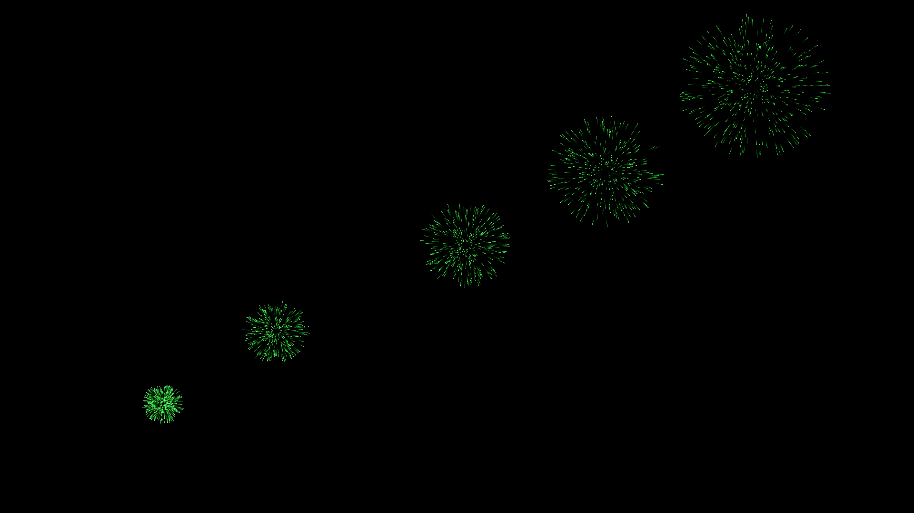
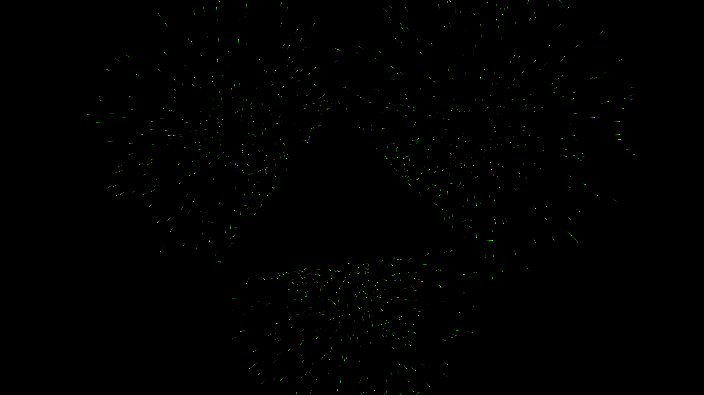

## Current x64 build: [Particles](https://github.com/Dabudabot/Particles/blob/master/build/Particles.msi "Particles")

# Particles: SDL2 project

Based on [Udemy course](https://www.udemy.com/course/free-learn-c-tutorial-beginners "Udemy course"), implemented using [SDL2](libsdl.org "SDL2") library.

## Description

Simple relaxing/meditation ~~game~~ screensaver

## Controls

esc - exit

tab - help

space - reset

f8  - autoplay

f9  - quick save

f10 - quick load

lmb - draw wall

rmb - explode particles

